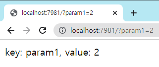
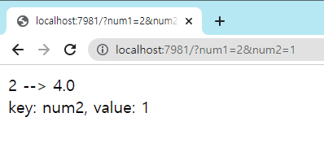

# Flask test 기록
Flask http server on the docker in the remote server

```
Docker --> server --> client
81 --> 7981 --> 7981
```

* Docker run
```bash
docker run -it --rm --gpus all -v -p 7981:81 DOCKER_IMAGE bash
```

*  Server-->Local SSH-port forwarding
```bash
ssh -N -f -L localhost:7981:localhost:7981 ID_SERVER@IP_SERVER -p SERVER_SSH_PORT
```

### hello_getparams.py
인자 받아보기




### hello_getparams2.py
인자 받아서 처리


